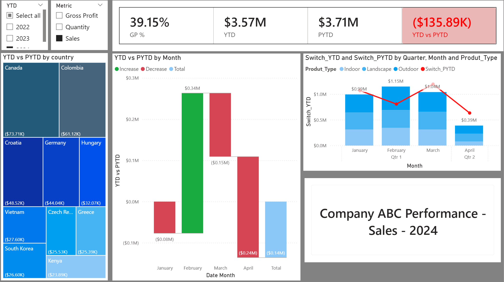

# Company ABC Performance Dashboard (Power BI + Excel)

## Overview
This project analyzes Company ABC’s sales and gross profit performance across multiple years, comparing year-to-date (YTD) vs prior year-to-date (PYTD). The dashboard highlights growth and decline by country, product type, and month.

## Tech Stack
- Power BI (Data modeling, DAX, Visualizations)
- Excel (Data source)

## Key Features
- Designed KPIs (Sales, Quantity, Gross Profit, Margins) and built interactive visuals (multi-year trends, country/product breakdowns, YTD vs PYTD comparisons).
- Applied advanced DAX measures for time intelligence (YTD, PYTD, dynamic switching) and conditional formatting to highlight growth vs decline.
- Delivered business insights into year-over-year growth, seasonal patterns, and country/product performance variations.

## Business Insights
- Identified countries and product types with declining performance vs prior year.
- Highlighted seasonal trends in monthly sales and gross profit.
- Provided a flexible reporting tool for management to track KPIs across multiple dimensions.

## Screenshots

- KPI cards
- Monthly trends chart
- Country performance treemap
- Slicer switch example
